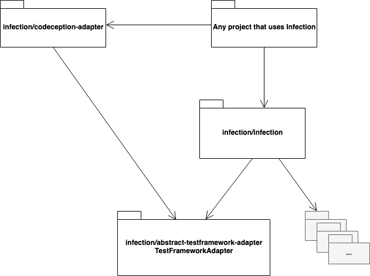

# Abstract TestFramework Adapter for Infection

This is a repository for Abstract TestFramework Adapter - interfaces and classes to use in Infection as an abstraction of any Test Framework.

### Infection - Mutation Testing Framework

Please read documentation here: [infection.github.io](http://infection.github.io)

Twitter: [@infection_php](http://twitter.com/infection_php)
