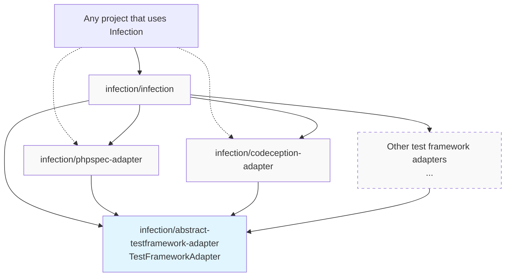

# Abstract TestFramework Adapter for Infection

This package provides the shared abstractions used by [Infection][infection] test framework adapters.


```mermaid
graph TB
    Project["Any project that uses Infection"]
    Infection["infection/infection"]
    AbstractAdapter["infection/abstract-testframework-adapter<br/>TestFrameworkAdapter"]
    PhpspecAdapter["infection/phpspec-adapter"]
    CodeceptionAdapter["infection/codeception-adapter"]
    OtherAdapters["Other test framework adapters<br/>..."]

    Project --> Infection
    Project -.-> PhpspecAdapter
    Project -.-> CodeceptionAdapter
    Infection --> AbstractAdapter
    Infection --> PhpspecAdapter
    Infection --> CodeceptionAdapter
    Infection --> OtherAdapters
    PhpspecAdapter --> AbstractAdapter
    CodeceptionAdapter --> AbstractAdapter
    OtherAdapters --> AbstractAdapter

    style AbstractAdapter fill:#e1f5fe
    style Infection fill:#f9f9f9
    style PhpspecAdapter fill:#f9f9f9
    style CodeceptionAdapter fill:#f9f9f9
    style OtherAdapters fill:#f9f9f9,stroke-dasharray: 5 5
```

Please read documentation here: [infection.github.io][doc]

* Twitter: [@infection_php][twitter]
* Mastodon: [@infection_php][mastodon]
* Discord: https://discord.gg/ZUmyHTJ
* [Playground](https://infection-php.dev/) - try it right in your browser!

## Installation

This package is meant to be used by Infection test framework adapters. In a standard usage, it is installed as a dependency of a concrete adapter such as [`infection/phpspec-adapter`][infection/phpspec-adapter] or
[`infection/codeception-adapter`][infection/codeception-adapter].

If you are building a custom adapter, you can install it as usual:

```shell
composer require infection/abstract-testframework-adapter
```

## Usage

Implement [`TestFrameworkAdapter`][test-framework-adapter] and [`TestFrameworkAdapterFactory`][test-framework-adapter-factory]
to expose a test framework integration to Infection.

The concrete adapter is responsible for translating Infection's test execution requests into the target test framework commands and for returning the collected test locations.

For more information on configuring Infection, see the [Infection documentation][infection-configuration-docs].

## Contributing

Contributions are welcome! Please see [CONTRIBUTING.md](.github/CONTRIBUTING.md) for details.

## License

This project is licensed under the BSD 3-Clause License. See the [LICENSE](LICENSE) file for details.


[doc]: http://infection.github.io
[infection]: https://infection.github.io
[infection-configuration-docs]: https://infection.github.io/guide/usage.html#Configuration
[infection/codeception-adapter]: https://packagist.org/packages/infection/codeception-adapter
[infection/phpspec-adapter]: https://packagist.org/packages/infection/phpspec-adapter
[test-framework-adapter]: ./src/TestFrameworkAdapter.php
[test-framework-adapter-factory]: ./src/TestFrameworkAdapterFactory.php
[twitter]: http://twitter.com/infection_php
[mastodon]: https://mastodon.social/@infection_php
